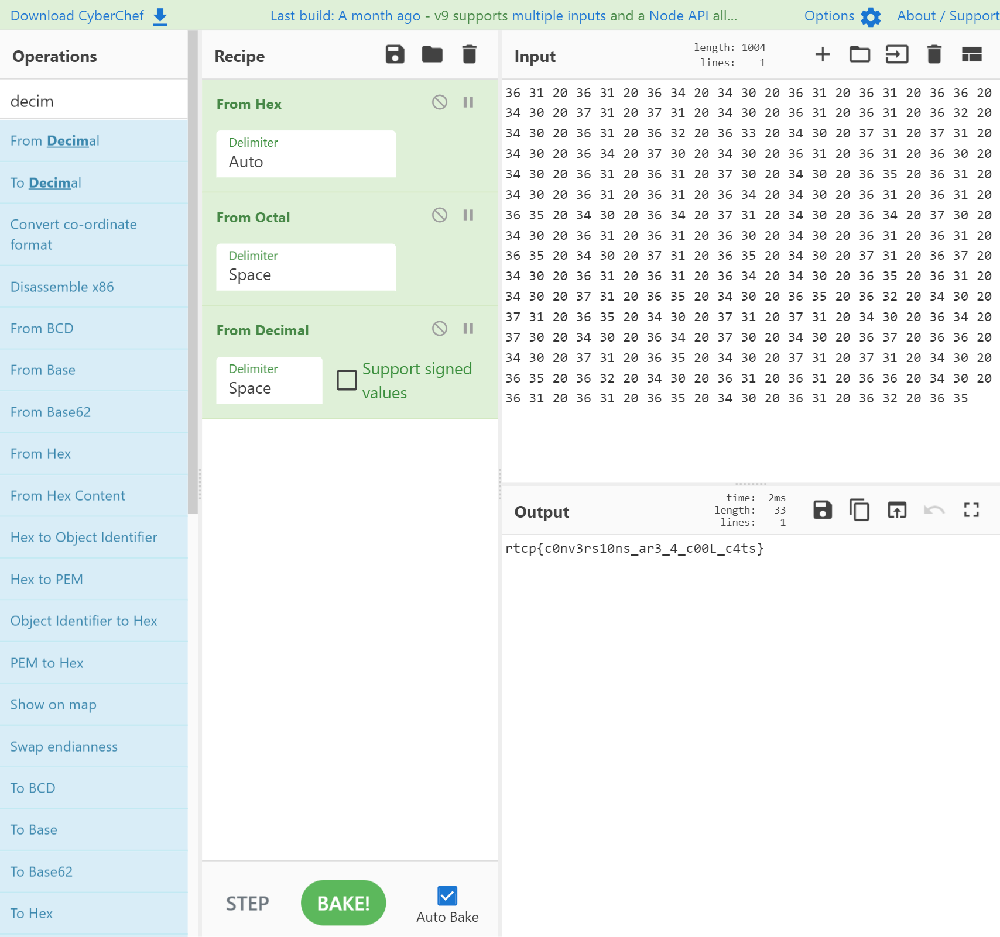

# That's a Lot of Stuff . . .

> Do you want some numbers? Here, take these numbers. I don't need them anyways. I have too many numbers at home, so go on, take them. Shoves numbers towards the computer screen

```
36 31 20 36 31 20 36 34 20 34 30 20 36 31 20 36 31 20 36 36 20 34 30 20 37 31 20 37 31 20 34 30 20 36 31 20 36 31 20 36 32 20 34 30 20 36 31 20 36 32 20 36 33 20 34 30 20 37 31 20 37 31 20 34 30 20 36 34 20 37 30 20 34 30 20 36 31 20 36 31 20 36 30 20 34 30 20 36 31 20 36 31 20 37 30 20 34 30 20 36 35 20 36 31 20 34 30 20 36 31 20 36 31 20 36 34 20 34 30 20 36 31 20 36 31 20 36 35 20 34 30 20 36 34 20 37 31 20 34 30 20 36 34 20 37 30 20 34 30 20 36 31 20 36 31 20 36 30 20 34 30 20 36 31 20 36 31 20 36 35 20 34 30 20 37 31 20 36 35 20 34 30 20 37 31 20 36 37 20 34 30 20 36 31 20 36 31 20 36 34 20 34 30 20 36 35 20 36 31 20 34 30 20 37 31 20 36 35 20 34 30 20 36 35 20 36 32 20 34 30 20 37 31 20 36 35 20 34 30 20 37 31 20 37 31 20 34 30 20 36 34 20 37 30 20 34 30 20 36 34 20 37 30 20 34 30 20 36 37 20 36 36 20 34 30 20 37 31 20 36 35 20 34 30 20 37 31 20 37 31 20 34 30 20 36 35 20 36 32 20 34 30 20 36 31 20 36 31 20 36 36 20 34 30 20 36 31 20 36 31 20 36 35 20 34 30 20 36 31 20 36 32 20 36 35
```

As usual CyberChef comes to the rescue
In order, from hex -> octal -> decimal and we have the flag



Flag : ```rtcp{c0nv3rs10ns_ar3_4_c00L_c4ts}```