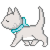
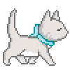

# What's in The Box?!

> Click the box and cute little kitties run all over your screen





Initially I thought it was a stego challenge until i found rtcp in the javascript function

Run a python script to clean the body and extract flag in multiple parts as javascript comments and we have it

```python
import re
regex = r"(\/\*(.*?)\*\/)"

with open ("boxhtml.txt", "r") as file:
    box = file.read().replace("\n","")

matches = re.finditer(regex, box)

x = ""
for _, match in enumerate(matches, start=1):
        x += match.group(2)
print x


```

Flag : ```rtcp{k4wA1I_kitT3nz_4_tH3_w1N!!_41232345}```