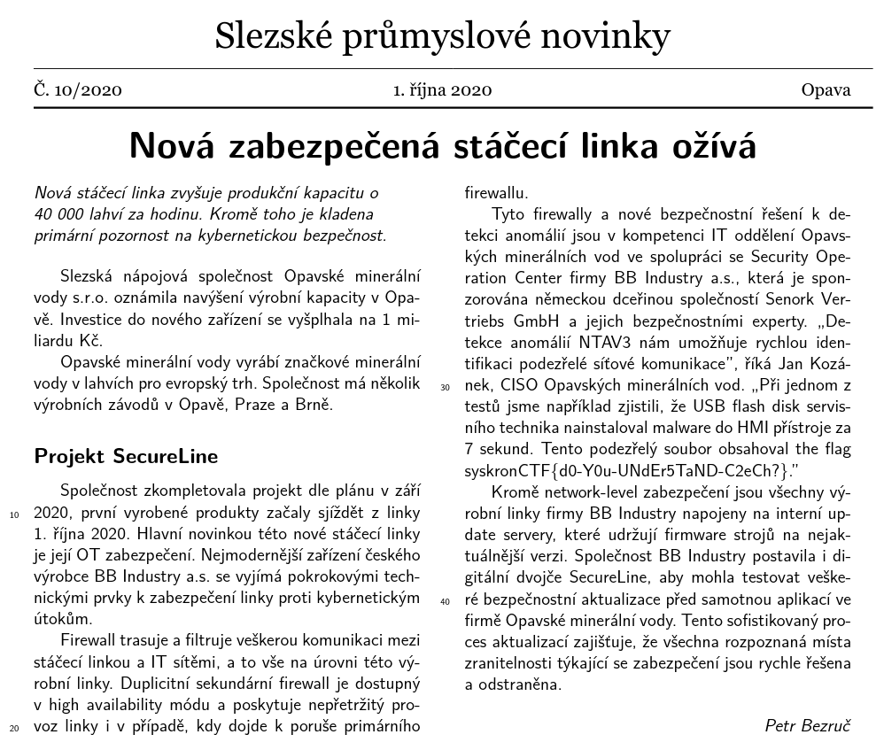
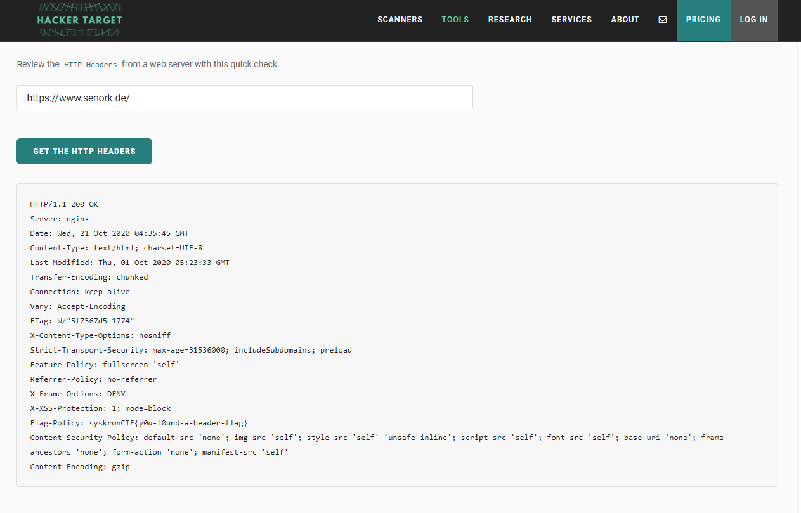

# Monday

## Redacted News

We got a png with a certain part removed
`binwalk, exiftool, steghide` shows nothing interesting.
`stegsolve` seems to work if we just see the rgb planes.  

Use imagemagick or similar tool to remove the alpha channel
```bash 
./magick convert 2020-10-1-secureline.png -alpha off output.png
```
and we get the flag



Flag : ```syskronCTF{d0-Y0u-UNdEr5TaND-C2eCh?}```

##  DOS Attack

Opened the packet capture, looks like a DNS flood to port 50000 but I could not figure out the name of the malware

Googled for `siemens dos attack malware`, first two reports by Claroty looks promising, dig some further digging on Industroyer leads to CVE-2015-5374
which according to CISA

> Specially crafted packets sent to Port 50000/UDP could cause a denial of service of the affected device. A manual reboot is required to return the device to service.

We have our malware XD

Flag `syskronCTF{Industroyer}`

## Security Headers

This was easier than expected, simply grab the http headers of `https://www.senork.de/`



Flag: `syskronCTF{y0u-f0und-a-header-flag}`